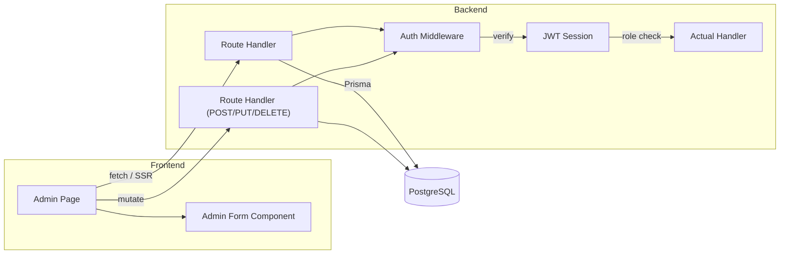

# 芯师爷运营后台 — 全功能开发计划

## 一、当前状态评估

### 已存在的基础设施
| 模块 | 状态 | 详情 |
|------|------|------|
| 数据库模型 | 完整 | 12 个模型：User, Session, Company, Product, Article, Event, EventRegistration, Job, JobApplication, AdSlot, Ad, AwardCampaign |
| 认证 | 基础 | JWT session 认证（jose），登录/登出 API，middleware 路由守卫 |
| UI 框架 | 完整 | Tailwind CSS 4，暗色主题（slate-950 底），Shell Layout |
| 管理员页面 | 极简 | 仅 dashboard 页面，2 个统计卡片，未使用任何 UI 组件库 |

### 缺失的关键功能
- 侧边栏：仅 2 项（控制台、返回前台），无内容管理入口
- 列表页：无文章/企业/活动/招聘/广告等任何 CRUD 页面
- API 路由：除了登录/登出 2 个接口，无其他后台 API
- 表单：无任何增删改查页面
- 审核流：企业入驻审核、文章发布审核未实现
- 广告管理：AdSlot + Ad 模型有但无管理界面
- 系统配置：无系统设置、用户管理、操作日志等
- Markdown 编辑器：无富文本编辑能力
- 角色体系：有 enum 但无实际操作层面的角色路由守卫

---

## 二、整体架构

### 2.1 路由设计

```
/admin                    → redirect → /admin/dashboard
/admin/dashboard          → 运营概览仪表盘
/admin/login              → 管理员登录

/admin/articles            → 文章列表（含筛选、搜索、批量操作）
/admin/articles/new        → 新建文章（富文本/Markdown 编辑器）
/admin/articles/[id]       → 编辑文章
/admin/articles/[id]/preview → 文章预览

/admin/companies           → 企业管理列表
/admin/companies/new       → 新建企业
/admin/companies/[id]      → 编辑企业
/admin/companies/[id]/review → 企业入驻审核

/admin/products            → 产品管理
/admin/products/[id]       → 编辑产品

/admin/events              → 活动管理
/admin/events/new          → 新建活动
/admin/events/[id]         → 编辑活动
/admin/events/[id]/registrations → 活动报名管理

/admin/events/[id]/registrations → 活动报名列表（导出 CSV）

/admin/jobs                → 招聘管理
/admin/jobs/new            → 发布职位
/admin/jobs/[id]           → 编辑职位
/admin/jobs/[id]/applicants → 应聘者管理

/admin/reports             → 报告管理
/admin/reports/[id]        → 编辑报告

/admin/awards              → 评选管理
/admin/awards/[id]         → 编辑评选

/admin/ads                 → 广告位管理（含 slot 管理）
/admin/ads/slots/[id]      → 广告位下的广告列表
/admin/ads/new             → 新建广告

/admin/users               → 管理员/用户管理
/admin/users/[id]          → 编辑用户/分配角色

/admin/settings            → 系统设置（站点信息、SEO、邮件模板等）
/admin/settings/email-templates → 邮件模板管理
/admin/settings/seo        → SEO / Open Graph 全局设置
/admin/logs                → 操作日志
```

### 2.2 角色权限体系

基于用户选择的子角色方案：

```typescript
enum AdminRole {
  SUPER_ADMIN     // 超管：所有权限，包括用户管理、系统设置、角色分配
  CONTENT_EDITOR  // 内容编辑：文章/活动/报告 CRUD + 审核
  BUSINESS_OPS    // 商务运营：企业/产品/广告/评选管理
  REVIEWER        // 审核员：仅审核队列（企业入驻、文章发布）
}
```

**Enterprise 后台** 保持独立的路由体系，但目前只有 dashboard 页，后续扩展企业的自助服务能力（管理自己的产品、文章、招聘等）。

### 2.3 组件架构

```
src/
├── components/
│   ├── admin/               # 后台专用组件
│   │   ├── admin-layout.tsx  # 后台 Shell Layout（侧边栏 + 顶栏）
│   │   ├── side-nav.tsx      # 新版侧边栏导航（可折叠分组）
│   │   ├── data-table.tsx    # 通用数据表格（排序、筛选、分页）
│   │   ├── search-input.tsx  # 搜索框组件
│   │   ├── status-badge.tsx  # 状态标签（草稿/已发布/待审核等）
│   │   ├── empty-state.tsx   # 空数据占位
│   │   ├── loading-skeleton.tsx # 骨架屏
│   │   ├── confirm-dialog.tsx   # 确认弹窗
│   │   ├── toast.tsx            # 操作反馈 Toast
│   │   └── page-header.tsx      # 页面标题 + 操作按钮
│   ├── admin/forms/         # 各模块表单组件
│   │   ├── article-form.tsx
│   │   ├── company-form.tsx
│   │   ├── event-form.tsx
│   │   ├── job-form.tsx
│   │   ├── report-form.tsx
│   │   ├── award-form.tsx
│   │   └── ad-form.tsx
│   └── admin/editor/        # 富文本编辑器
│       ├── markdown-editor.tsx
│       └── media-upload.tsx  # 图片上传（拖拽/粘贴/URL 输入）
```

### 2.4 数据流



---

## 三、具体模块计划

### 模块 1：后台 Shell & 导航重构（基础骨架）

**核心文件**：
- `src/app/admin/(app)/layout.tsx` → 重写为新版 AdminLayout
- `src/components/admin/side-nav.tsx` — 新建
- `src/components/admin/page-header.tsx` — 新建

**功能**：
- 全新的侧边栏导航，按功能分组：
  - **内容管理**：文章、活动、报告、评选
  - **企业管理**：企业、产品
  - **招聘管理**：职位、应聘
  - **广告管理**：广告位、广告
  - **系统管理**：用户、设置、操作日志
- 导航分组可折叠/展开
- 当前路由高亮
- 响应式：移动端隐藏侧边栏，汉堡菜单展开
- 顶部栏：当前用户信息（头像、角色标签、退出登录）

**UI 设计原则**：沿用深海暗色主题（slate-950），参考 Vercel/Linear 风格。侧边栏 240px 宽，图标使用 Heroicons（已预装）。交互细节：hover 微高亮、active 左竖条指示、分组小标题模糊文字。

---

### 模块 2：Dashboard 仪表盘

**核心文件**：
- `src/app/admin/(app)/dashboard/page.tsx` → 重写
- `src/components/admin/stats-card.tsx` — 新建

**功能**：
- 顶部 KPI 卡片行：文章总数、本月发布数、企业总数、待审核企业数、待审文章数、本月活动数、注册报名数
- 图表区（轻量，考虑 recharts 或纯 CSS 柱状条）：
  - 近 7 日发布趋势
  - 各分类文章分布
  - 企业入驻趋势
- 快速操作入口：发布文章、审核入驻、创建活动
- 最近待处理事项列表

---

### 模块 3：通用组件库

**核心文件**（全部新建）：
- `src/components/admin/data-table.tsx`
- `src/components/admin/status-badge.tsx`
- `src/components/admin/empty-state.tsx`
- `src/components/admin/confirm-dialog.tsx`
- `src/components/admin/toast.tsx`
- `src/components/admin/loading-skeleton.tsx`
- `src/components/admin/search-input.tsx`
- `src/components/admin/pagination.tsx`

**特点**：纯 Tailwind CSS + Server Components + Client Components 边界清晰。Client Components 只保留交互部分（弹窗、Toast、搜索输入），列表和表格用 RSC。

**DataTable 设计**：列配置化（column definitions），支持排序、搜索、分页、批量选择、选中后批量操作。每行末尾操作菜单。

---

### 模块 4：文章管理（Content Core）

这是媒体平台的核心功能，投入最大。

**页面**：
- `src/app/admin/(app)/articles/page.tsx` — 文章列表
- `src/app/admin/(app)/articles/new/page.tsx` — 新建文章
- `src/app/admin/(app)/articles/[id]/page.tsx` — 编辑文章
- `src/app/admin/(app)/articles/[id]/preview/page.tsx` — 文章预览

**API 路由**：
- `GET /api/admin/articles` — 列表（分页、分类/标签/状态/日期筛选、搜索）
- `POST /api/admin/articles` — 新建
- `GET /api/admin/articles/[id]` — 单篇详情
- `PUT /api/admin/articles/[id]` — 更新
- `DELETE /api/admin/articles/[id]` — 删除（软删除 → deletedAt）
- `PATCH /api/admin/articles/[id]/status` — 变更状态

**列表页**：表格展示标题、分类、标签、作者、状态、发布时间。支持按状态分页查看（全部/草稿/待审/已发布/已归档）。状态用彩色标签区分。

**编辑页**：完整表单：
- 标题（slug 自动生成或手动编辑）
- 摘要（textare, 2-3行）
- 封面图（输入 URL + 预览 + 上传）
- 分类（下拉选择器，可配置的文章分类列表）
- 标签（多标签输入，可创建新标签）
- 作者 & 来源
- 关联企业（从已有企业列表选择）
- Markdown 正文（编辑器组件）
- 发布设置：立即发布 / 定时发布
- 状态流转按钮：保存草稿 → 提交审核 → 审核通过 → 发布 → 归档

**Markdown 编辑器**：使用 `@uiw/react-md-editor` 或自建基于 CodeMirror/Monaco 的精简版。功能：粗体、斜体、标题（H1-H3）、链接、图片插入、代码块、引用、分隔线、预览模式。CMS 使用 Markdown 存储（content 字段）。

---

### 模块 5：企业管理

**页面**：
- `src/app/admin/(app)/companies/page.tsx` — 企业列表
- `src/app/admin/(app)/companies/new/page.tsx` — 新建企业
- `src/app/admin/(app)/companies/[id]/page.tsx` — 编辑企业
- `src/app/admin/(app)/companies/[id]/review/page.tsx` — 审核页面

**API 路由**：
- `GET /api/admin/companies` — 列表（支持状态/行业/城市筛选）
- `POST /api/admin/companies` — 新建
- `GET /api/admin/companies/[id]` — 详情
- `PUT /api/admin/companies/[id]` — 更新
- `DELETE /api/admin/companies/[id]` — 软删除
- `PATCH /api/admin/companies/[id]/status` — 审核（APPROVED/REJECTED/SUSPENDED）
- `GET /api/admin/companies/pending` — 待审核列表

**表单**：企业名称、Slug（唯一）、Logo（URL/上传）、简介、网站、行业（下拉）、规模（下拉）、城市、关联用户（多选或输入邮箱邀请）

**审核流程**：待审核列表 → 查看企业详情 → 审核通过/驳回（附驳回理由）→ 通知企业用户（后续邮件/站内通知）

---

### 模块 6：产品管理

**页面**：
- `src/app/admin/(app)/products/page.tsx` — 产品列表
- `src/app/admin/(app)/products/[id]/page.tsx` — 编辑产品

**API 路由**：
- `GET /api/admin/products` — 列表
- `GET /api/admin/products/[id]` — 详情
- `PUT /api/admin/products/[id]` — 更新
- `POST /api/admin/products` — 新建
- `DELETE /api/admin/products/[id]` — 删除

**说明**：产品依附于企业。列表页展示产品名、所属企业、分类、状态、创建时间。编辑页可切换所属企业。

---

### 模块 7：活动管理

**页面**：
- `src/app/admin/(app)/events/page.tsx` — 活动列表
- `src/app/admin/(app)/events/new/page.tsx` — 新建活动
- `src/app/admin/(app)/events/[id]/page.tsx` — 编辑活动
- `src/app/admin/(app)/events/[id]/registrations/page.tsx` — 报名管理

**API 路由**：
- `GET /api/admin/events` — 列表（按类型/状态筛选）
- `POST /api/admin/events` — 新建
- `GET /api/admin/events/[id]` — 详情
- `PUT /api/admin/events/[id]` — 更新
- `DELETE /api/admin/events/[id]` — 删除
- `GET /api/admin/events/[id]/registrations` — 报名列表（分页 + CSV 导出）
- `PATCH /api/admin/events/[id]/registrations/[regId]/status` — 确认参加/拒绝

**活动类型**枚举：EXHIBITION(展会), CONFERENCE(峰会), WEBINAR(线上), SALON(沙龙), WORKSHOP(培训)

**报名管理**：表格展示姓名、邮箱、电话、公司、职位、报名时间。操作：确认参加、拒绝。导出 CSV 功能。

---

### 模块 8：招聘管理

**页面**：
- `src/app/admin/(app)/jobs/page.tsx` — 职位列表
- `src/app/admin/(app)/jobs/new/page.tsx` — 新增职位
- `src/app/admin/(app)/jobs/[id]/page.tsx` — 编辑职位
- `src/app/admin/(app)/jobs/[id]/applicants/page.tsx` — 应聘者管理

**API 路由**：
- `GET /api/admin/jobs` — 列表
- `POST /api/admin/jobs` — 新增
- `GET /api/admin/jobs/[id]` — 详情
- `PUT /api/admin/jobs/[id]` — 更新
- `DELETE /api/admin/jobs/[id]` — 删除
- `GET /api/admin/jobs/[id]/applicants` — 应聘列表
- `PATCH /api/admin/jobs/[id]/applicants/[appId]/status` — 更新应聘状态

**应聘状态管理**：PENDING → REVIEWED → INTERVIEWING → ACCEPTED/REJECTED

---

### 模块 9：报告管理

**页面**：
- `src/app/admin/(app)/reports/page.tsx` — 报告列表
- `src/app/admin/(app)/reports/[id]/page.tsx` — 编辑报告

**API 路由**：
- `GET /api/admin/reports` — 列表
- `POST /api/admin/reports` — 新建
- `GET /api/admin/reports/[id]` — 详情
- `PUT /api/admin/reports/[id]` — 更新
- `DELETE /api/admin/reports/[id]` — 删除

---

### 模块 10：评选管理

**页面**：
- `src/app/admin/(app)/awards/page.tsx` — 评选活动列表
- `src/app/admin/(app)/awards/new/page.tsx` — 新建评选
- `src/app/admin/(app)/awards/[id]/page.tsx` — 编辑评选

**API 路由**：
- `GET /api/admin/awards` — 列表
- `POST /api/admin/awards` — 新建
- `GET /api/admin/awards/[id]` — 详情
- `PUT /api/admin/awards/[id]` — 更新
- `DELETE /api/admin/awards/[id]` — 删除

---

### 模块 11：广告管理

**页面**：
- `src/app/admin/(app)/ads/page.tsx` — 广告位列表
- `src/app/admin/(app)/ads/slots/[id]/page.tsx` — 某广告位下的广告管理
- `src/app/admin/(app)/ads/new/page.tsx` — 新建广告

**API 路由**：
- `GET /api/admin/ads/slots` — 广告位列表
- `POST /api/admin/ads/slots` — 新建广告位
- `PUT /api/admin/ads/slots/[id]` — 更新广告位
- `GET /api/admin/ads?slotId=xxx` — 某广告位下的广告列表
- `POST /api/admin/ads` — 新建广告
- `PUT /api/admin/ads/[id]` — 更新广告
- `DELETE /api/admin/ads/[id]` — 删除

**广告字段**：标题、图片 URL、跳转链接、排序、曝光量（自动累加）、点击量（自动累加）、投放起止日期、启用状态。

---

### 模块 12：用户 & 角色管理

**页面**：
- `src/app/admin/(app)/users/page.tsx` — 用户列表
- `src/app/admin/(app)/users/[id]/page.tsx` — 编辑用户

**API 路由**：
- `GET /api/admin/users` — 列表
- `PUT /api/admin/users/[id]` — 更新角色/基本信息
- `POST /api/admin/users` — 新建管理员账号
- `DELETE /api/admin/users/[id]` — 停用用户（软删除）

---

### 模块 13：系统设置

**页面**：
- `src/app/admin/(app)/settings/page.tsx` — 系统设置

**配置内容**（存储在 settings 表或环境变量中，初步建议新建 Setting 模型或使用简单的 JSON config 表）：

```prisma
model Setting {
  id    String @id @default(cuid())
  key   String @unique
  value Json
}
```

**配置项**：
- 站点名称、描述、Logo
- 默认 SEO title/description
- Open Graph 默认图片
- 文章分类列表（可配置）
- 活动类型列表
- 行业列表（用于企业选择）
- 首页广告位配置
- 邮件发送配置（SMTP/发送者信息）
- 注册/登录设置

---

### 模块 14：操作日志（Audit Log）

**新建模型**：

```prisma
model AuditLog {
  id        String   @id @default(cuid())
  userId    String?
  userEmail String?
  action    String   // "CREATE_ARTICLE", "APPROVE_COMPANY", "UPDATE_EVENT"...
  resource  String   // "Article", "Company", "Event"...
  resourceId String?
  detail    Json?
  createdAt DateTime @default(now())

  @@index([createdAt])
  @@index([userId])
  @@index([resource, resourceId])
}
```

**页面**：`/admin/logs` — 操作日志查询，按操作类型、资源、时间筛选。

**实现方式**：在每个 MUTATION API 的末尾写一行 `prisma.auditLog.create(...)`。使用中间件模式减少重复代码。

---

## 四、研发计划阶段划分

### 第一阶段：骨架 & 核心内容管理（预估：8-12 天）

| 顺序 | 关键交付 | 估计工时 |
|------|---------|---------|
| 1.1 | Schema 扩展（AdminRole, Setting, AuditLog）+ `prisma db push` | 0.5天 |
| 1.2 | 后台 Layout 重构 + 完整侧边栏导航 + 角色守卫 | 1天 |
| 1.3 | 通用组件库（DataTable, StatusBadge, Toast, ConfirmDialog, 分页等） | 1.5天 |
| 1.4 | Dashboard 仪表盘（完整统计 + 待处理 + 图表） | 1天 |
| 1.5 | 文章管理完整 CRUD（列表/新建/编辑/预览/状态流转）+ Markdown 编辑器 | 3天 |
| 1.6 | 企业管理（列表/新建/编辑/审核流程） | 1.5天 |
| 1.7 | 产品管理（列表/编辑） | 0.5天 |
| 1.8 | 用户管理 & 角色分配 | 1天 |

### 第二阶段：扩展内容 & 运营工具（预估：5-8 天）

| 顺序 | 关键交付 | 估计工时 |
|------|---------|---------|
| 2.1 | 活动管理（创建/编辑/列表 + 报名列表 + CSV 导出） | 1.5天 |
| 2.2 | 招聘管理（职位 CRUD + 应聘者状态管理） | 1.5天 |
| 2.3 | 报告管理（CRUD + 文件上传管理） | 1天 |
| 2.4 | 评选管理（CRUD） | 1天 |
| 2.5 | 广告位管理（Slot + Ad 管理 + 曝光/点击统计） | 1天 |

### 第三阶段：系统管理 & 增值功能（预估：3-5 天）

| 顺序 | 关键交付 | 估计工时 |
|------|---------|---------|
| 3.1 | 系统设置页面（站点信息、SEO、分类配置等） | 1.5天 |
| 3.2 | 操作审计日志（模型 + 中间件 + 查询页面） | 1天 |
| 3.3 | 图片上传能力（本地上传 / S3 集成 / 粘贴上传） | 1天 |
| 3.4 | 批量导出功能（文章/企业/活动报名 CSV） | 0.5天 |
| 3.5 | 整体打磨：loading 状态、空态、错误态、边缘 case | 1天 |

**总计预估**：16-25 天

---

## 五、需要新建的文件清单

```
ARCHITECTURE HIGHLIGHTS (file count ~80+)

prisma/schema.prisma              ← 新增 Setting, AuditLog, User.adminRole 字段
prisma/seed.ts                    ← 新增更丰富的管理用户和设置数据

src/app/admin/(app)/layout.tsx    ← 重写（完整侧边栏导航）
src/components/admin/
  ├── side-nav.tsx                ← 新建
  ├── data-table.tsx              ← 新建
  ├── page-header.tsx             ← 新建
  ├── status-badge.tsx            ← 新建
  ├── empty-state.tsx             ← 新建
  ├── confirm-dialog.tsx          ← 新建
  ├── toast.tsx                   ← 新建
  ├── loading-skeleton.tsx        ← 新建
  ├── search-input.tsx            ← 新建
  ├── pagination.tsx              ← 新建
  └── stats-card.tsx              ← 新建

src/components/admin/forms/
  ├── article-form.tsx            ← 新建
  ├── company-form.tsx            ← 新建
  ├── event-form.tsx              ← 新建
  ├── job-form.tsx                ← 新建
  ├── report-form.tsx             ← 新建
  ├── award-form.tsx              ← 新建
  └── ad-form.tsx                 ← 新建

src/components/admin/editor/
  ├── markdown-editor.tsx         ← 新建（集成 @uiw/react-md-editor 或自建）
  └── image-upload.tsx            ← 新建

src/app/admin/(app)/dashboard/page.tsx  ← 重写
src/app/admin/(app)/articles/page.tsx  ← 新建
src/app/admin/(app)/articles/new/page.tsx ← 新建
src/app/admin/(app)/articles/[id]/page.tsx ← 新建
src/app/admin/(app)/articles/[id]/preview/page.tsx ← 新建
src/app/admin/(app)/companies/page.tsx ← 新建
src/app/admin/(app)/companies/new/page.tsx ← 新建
src/app/admin/(app)/companies/[id]/page.tsx ← 新建
src/app/admin/(app)/companies/[id]/review/page.tsx ← 新建
src/app/admin/(app)/products/page.tsx ← 新建
src/app/admin/(app)/products/[id]/page.tsx ← 新建
src/app/admin/(app)/events/page.tsx ← 新建
src/app/admin/(app)/events/new/page.tsx ← 新建
src/app/admin/(app)/events/[id]/page.tsx ← 新建
src/app/admin/(app)/events/[id]/registrations/page.tsx ← 新建
src/app/admin/(app)/jobs/page.tsx ← 新建
src/app/admin/(app)/jobs/new/page.tsx ← 新建
src/app/admin/(app)/jobs/[id]/page.tsx ← 新建
src/app/admin/(app)/jobs/[id]/applicants/page.tsx ← 新建
src/app/admin/(app)/reports/page.tsx ← 新建
src/app/admin/(app)/reports/[id]/page.tsx ← 新建
src/app/admin/(app)/awards/page.tsx ← 新建
src/app/admin/(app)/awards/new/page.tsx ← 新建
src/app/admin/(app)/awards/[id]/page.tsx ← 新建
src/app/admin/(app)/ads/page.tsx ← 新建
src/app/admin/(app)/ads/slots/[id]/page.tsx ← 新建
src/app/admin/(app)/ads/new/page.tsx ← 新建
src/app/admin/(app)/users/page.tsx ← 新建
src/app/admin/(app)/users/[id]/page.tsx ← 新建
src/app/admin/(app)/settings/page.tsx ← 新建
src/app/admin/(app)/logs/page.tsx ← 新建

src/app/api/admin/articles/route.ts ← 新建 (GET/POST)
src/app/api/admin/articles/[id]/route.ts ← 新建 (GET/PUT/DELETE)
src/app/api/admin/articles/[id]/status/route.ts ← 新建 (PATCH)
src/app/api/admin/companies/route.ts ← 新建
src/app/api/admin/companies/[id]/route.ts ← 新建
src/app/api/admin/companies/[id]/status/route.ts ← 新建
src/app/api/admin/products/route.ts ← 新建
src/app/api/admin/products/[id]/route.ts ← 新建
src/app/api/admin/events/route.ts ← 新建
src/app/api/admin/events/[id]/route.ts ← 新建
src/app/api/admin/events/[id]/registrations/route.ts ← 新建
src/app/api/admin/jobs/route.ts ← 新建
src/app/api/admin/jobs/[id]/route.ts ← 新建
src/app/api/admin/jobs/[id]/applicants/route.ts ← 新建
src/app/api/admin/jobs/[id]/applicants/[appId]/status/route.ts ← 新建
src/app/api/admin/reports/route.ts ← 新建
src/app/api/admin/reports/[id]/route.ts ← 新建
src/app/api/admin/awards/route.ts ← 新建
src/app/api/admin/awards/[id]/route.ts ← 新建
src/app/api/admin/ads/slots/route.ts ← 新建
src/app/api/admin/ads/slots/[id]/route.ts ← 新建
src/app/api/admin/ads/route.ts ← 新建
src/app/api/admin/ads/[id]/route.ts ← 新建
src/app/api/admin/users/route.ts ← 新建
src/app/api/admin/users/[id]/route.ts ← 新建
src/app/api/admin/settings/route.ts ← 新建
src/app/api/admin/upload/route.ts ← 新建（图片上传）
```

---

## 六、技术选型说明

| 需求 | 选择 | 理由 |
|------|------|------|
| UI 组件 | 纯 Tailwind CSS，自建组件库 | 保持与前台一致的极简/暗色风格，避免引入重量级库（如 shadcn/ui 会增加构建复杂度和包体积） |
| 图标 | Heroicons（通过 `@heroicons/react`，项目已有？） | 统一风格，或直接用 SVG inline |
| 富文本/Markdown | `@uiw/react-md-editor`（约 8KB gzip）| 轻量、React 18 兼容、支持 Markdown 编辑+预览双栏 |
| 图表 | recharts（约 10KB gzip）| 轻量、声明式、React 原生、柱状图/折线图可满足所有需求 |
| 表格 | 自建 DataTable 组件 | 避免引入 @tanstack/react-table 等重量级库；需求相对标准，自建更灵活 |
| 表单验证 | Zod（项目已安装）| 前端 + API 共用 schema |
| 图片上传 | 初步：接受 URL；后续：`multer` + 本地 `public/uploads` 或 S3 | 最小可行方案，需确认部署环境 |
| 日期时间 | `date-fns`（项目已安装）| 已在项目中，格式化日期用 |
| 状态管理 | 不需要 | RSC + 页面级 fetch，表单状态用 local state 即可 |
| 文件导出 | 后端拼接 CSV 字符串，前端下载 blob | 轻量，无需引入 excel 库 |

---

## 七、关键设计决策说明

1. **CSR vs SSR**：后台页面用 `force-dynamic` + 客户端数据获取（`use` + fetch 或 SWR）。原因是后台天然需要实时数据，且对首屏性能不敏感。但每个页面的 Layout 部分（侧边栏导航、用户信息）保持 RSC。

2. **通用 DataTable**：采用列配置模式，支持 `columns: [{ key, label, sortable, render }]`。排序由后端实现，前端传递 `sortBy` 和 `sortOrder` 参数。分页由后端 `skip/take` 实现。

3. **表单复用**：新建和编辑共用同一个 Form 组件，通过 `initialData` prop 区分。Form 是 Client Component，提交时调用 API。

4. **Toast 体系**：使用 `useReducer` 管理的全局 Toast Context，包裹在 AdminLayout 中。操作完成后 `triggerToast({ type: 'success', message })`。

5. **审核流程**：不使用独立审核页面，而是在企业/文章详情页中增加审核面板。审核员视角看到"通过/驳回"按钮，编辑视角看到"提交审核"按钮。

6. **操作日志**：不阻塞主流程。`prisma.$use` 中间件自动捕获关键写操作写入 AuditLog，或手动在每个 API handler 末尾异步写入（不 await）。

---

## 八、现有代码可以复用的部分

| 现有文件 | 是否复用 |
|---------|---------|
| `src/components/auth/login-form.tsx` | 复用，但可以调整样式 |
| `src/components/auth/logout-button.tsx` | 复用 |
| `src/lib/auth/session.ts` | 复用，添加 `adminRole` 到 SessionPayload |
| `src/lib/prisma.ts` | 复用 |
| `src/middleware.ts` | 复用，扩展角色检查 |
| `src/app/admin/(app)/layout.tsx` | 重写 |
| `src/app/admin/login/page.tsx` | 复用 |
| `web/prisma/schema.prisma` | 扩展 |
| `web/prisma/seed-data.ts` + `seed.ts` | 复用，追加管理用户和设置数据 |
